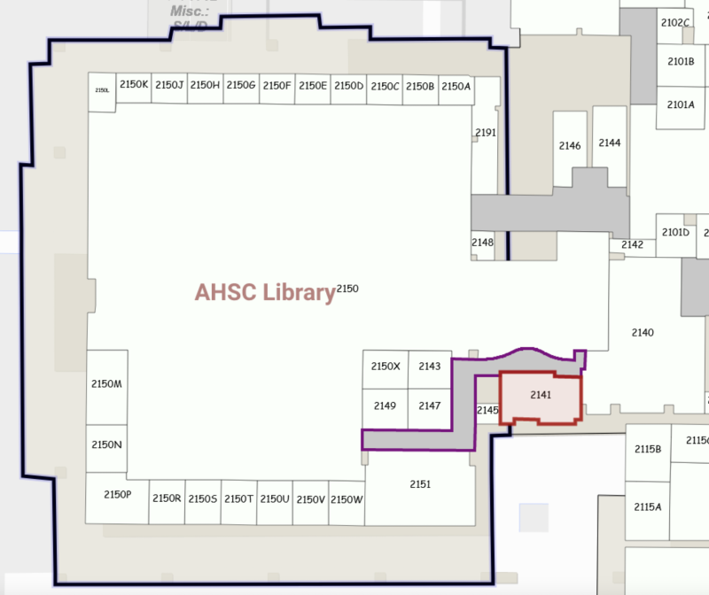

---
hide:
  - navigation
---

# Meeting Informations / Directions

**Biosciences Toastmasters currently holds hybrid meetings in person and on Zoom.**

In-person meetings are in the Health Sciences Library room 2141, within the University of Arizona Health Sciences campus, located north of Speedway and west of Campbell.

Guests may request the Zoom link by clicking the “Contact Us” link on the top left-hand side of this page.

Feel free to contact us with any questions. All are welcome to visit a meeting to see if Toastmasters is a good fit.

Public parking is available in the Health Sciences Parking Garage (1501 N. Campbell Ave., on the top level only) and the Highland Avenue Garage (1420 E. Helen St.). The cost is $2 per hour; no cash; credit and debit cards only. Visitors also may use the Passport Parking app to pay for parking; the app is free to download from [iOS](https://apps.apple.com/us/app/passportparking-mobile-pay/id501324867) or [Android](https://play.google.com/store/apps/details?id=com.passportparking.mobile&hl=en). Additional metered parking is available in various lots on the Health Sciences campus. Check out the [UArizona Parking Map](https://parking.arizona.edu/permits/images/2022-2023_parking_map.pdf), which shows where visitors can find hourly parking.