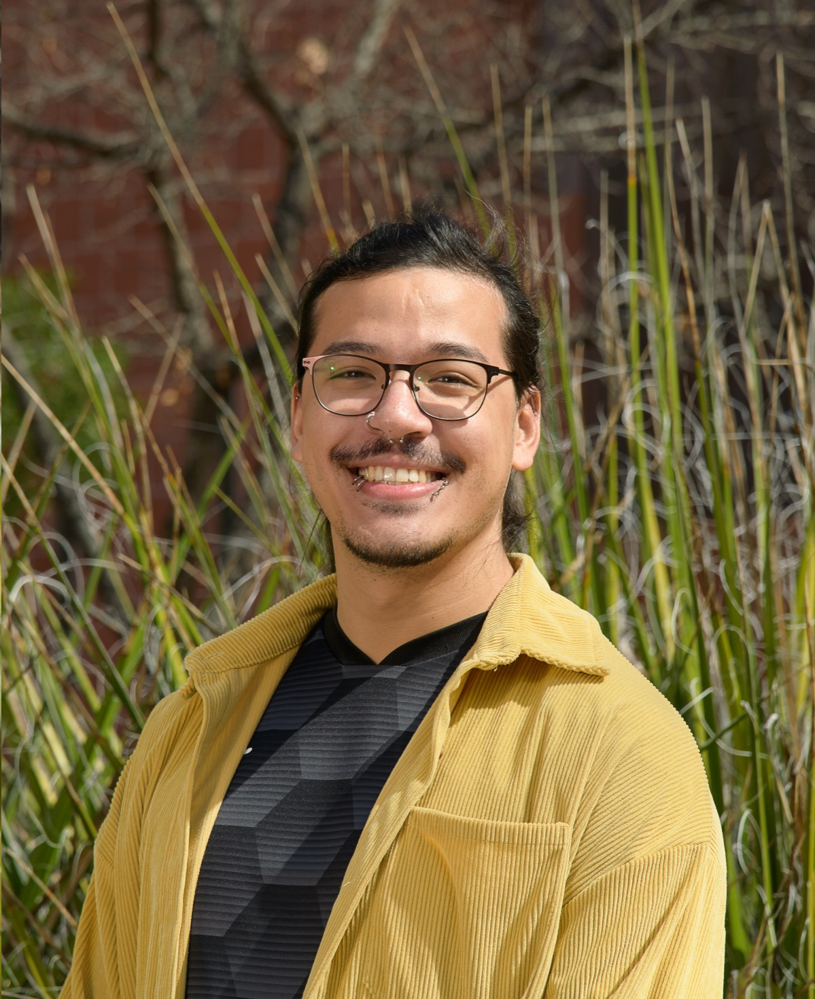
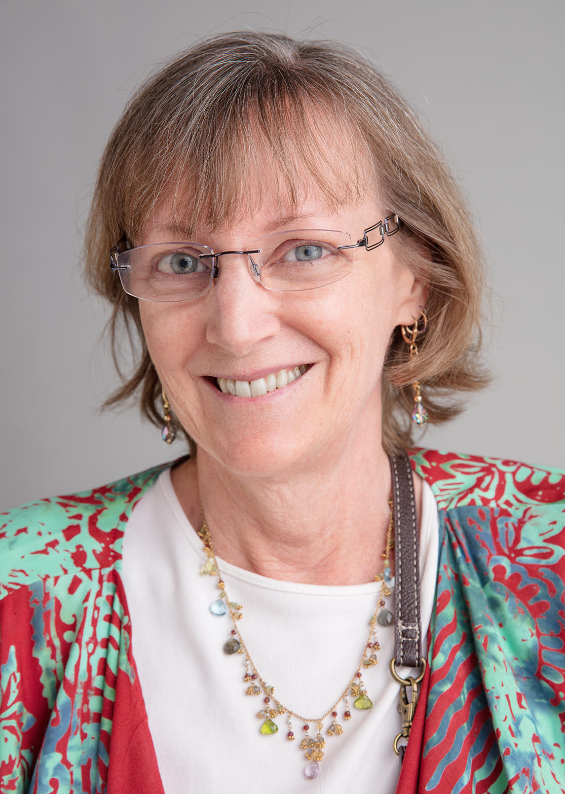

---
hide:
  - navigation
---

# Meet Our Members!

!!! Note ""
    ## Anna Christensen

    { align=right }
    **Role**
    
    Lorem ipsum dolor sit amet, consectetur adipiscing elit. Vivamus eros lectus, placerat vel tortor vitae, tristique elementum felis. Phasellus nec diam a augue bibendum sollicitudin. Vivamus consectetur, nulla vel eleifend convallis, mi nulla fermentum elit, ultrices bibendum velit tellus non lectus.

!!! Note ""
    ## Michele Cosi

    { style="width:150px", align="right" }
    **Sergenant at Arms**

    Michele has been a member of the club since 2021. "Biosciences Toastmasters not only allows me to improve my speech skills, but also to understand further what makes a good speech. This includes learning about people, cultures, and the various details that usually hide behind speechcraft." Michele has a background in Plant Sciences (but has the brownest thumb), and is a Data Scientist for CyVerse/Data Science Institute at the University of Arizona.

!!! Note ""
    ## Jim Davis

    { align=right }
    **Role**

    Lorem ipsum dolor sit amet, consectetur adipiscing elit. Vivamus eros lectus, placerat vel tortor vitae, tristique elementum felis. Phasellus nec diam a augue bibendum sollicitudin. Vivamus consectetur, nulla vel eleifend convallis, mi nulla fermentum elit, ultrices bibendum velit tellus non lectus.

!!! Note ""
    ## Jenn De La Rosa

    { align=right }
    **Role**

    Lorem ipsum dolor sit amet, consectetur adipiscing elit. Vivamus eros lectus, placerat vel tortor vitae, tristique elementum felis. Phasellus nec diam a augue bibendum sollicitudin. Vivamus consectetur, nulla vel eleifend convallis, mi nulla fermentum elit, ultrices bibendum velit tellus non lectus.

!!! Note ""
    ## Susan Miller

    { style="width:150px", align="right" }
    **Role**

    Susan has been a member of Biosciences Toastmasters since 2009. Her Toastmasters experience helped immensely in her career in scientific computing. Susan also enjoys singing with Desert Voices Community Chorus, volunteering for PAWSitively CATS, and making bracelets for Beading Divas to the Rescue.

!!! Note ""
    ## Sarah Roberts

    { align=right }
    **Role**
    
    Lorem ipsum dolor sit amet, consectetur adipiscing elit. Vivamus eros lectus, placerat vel tortor vitae, tristique elementum felis. Phasellus nec diam a augue bibendum sollicitudin. Vivamus consectetur, nulla vel eleifend convallis, mi nulla fermentum elit, ultrices bibendum velit tellus non lectus.    
